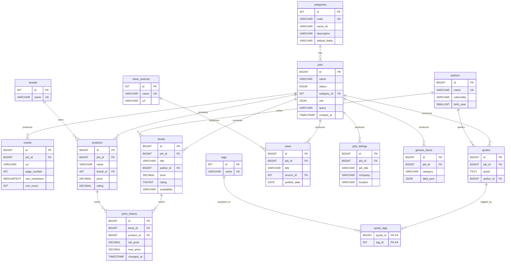

# 数据库设计文档

> AI-Scraper 项目 — 关系数据库设计与实现
> DBMS: MySQL 8.0
> 字符集: utf8mb4 / utf8mb4_unicode_ci

---

## 一、设计目标

本系统是一个 RPA 数据自动化采集工具,需把 AI 从任意网站提取的结构化数据**按业务类别**持久化到关系数据库。设计目标:

1. **业务清晰**:不同领域(图书 / 商品 / 名言 / 新闻 / 招聘)有各自的字段和约束,不混在一张大表
2. **避免冗余**:作者、品牌、新闻来源等高频复用值抽成维度表,通过外键关联
3. **数据完整性**:关键字段(标题、价格、评分)用 CHECK / UNIQUE / FK 多重保障
4. **支持历史追踪**:价格变化用触发器自动入历史表,实现审计能力
5. **支持高效查询**:对常用筛选字段加索引,对长文本字段加全文索引
6. **支持可视化**:封装常用 JOIN 为视图,前端直接 SELECT 视图减少代码

---

## 二、ER 图



---

## 三、表结构总览

数据库共 **15 张表 + 4 个视图 + 2 个触发器**,按职责分四层:

### 1. 元数据层 (3 张)

| 表 | 行数(估) | 职责 |
|----|---------|------|
| `categories` | 13 | 网站类别字典 (books/news/jobs/products/...) |
| `jobs` | ~10 | 采集任务记录 |
| `results` | ~30 | 每页抓取结果(原始 markdown + LLM CSV) |

### 2. 维度层 (4 张)

抽出高频复用值,避免在业务表中重复存储字符串。

| 表 | 行数(估) | 职责 |
|----|---------|------|
| `authors` | 37 | 作者(books / quotes 共用) |
| `brands` | 0+ | 品牌(products 用) |
| `news_sources` | 0+ | 新闻来源(news 用) |
| `tags` | 2+ | 标签(quotes 多对多) |

### 3. 业务层 (6 张)

按类别拆分专属表,每张表的字段和约束都贴合该领域。

| 表 | 行数(估) | 类别 | 主要字段 |
|----|---------|------|---------|
| `books` | 20 | 图书 | title / author / price / rating / availability |
| `quotes` | 240 | 名言 | quote / author |
| `products` | 16 | 商品 | name / brand / price / sku |
| `news` | 0+ | 新闻 | title / publish_date / summary |
| `jobs_listings` | 0+ | 招聘 | job_title / company / location |
| `generic_items` | 0 | 兜底 | data_json (无专属表的类别走这里) |

### 4. 关联与审计层 (2 张)

| 表 | 类型 | 职责 |
|----|------|------|
| `quote_tags` | 多对多关联表 | quote ↔ tag |
| `price_history` | 审计/历史表 | books/products 价格变更自动入此表(触发器维护) |

---

## 四、范式分析

### 第一范式 (1NF) — 列原子性
- 所有列都是不可分割的原子值
- 不存在"用逗号分隔的字符串列表"等违规模式
- 例:`books.author` 不直接存字符串,而是 FK 到 `authors.id`

### 第二范式 (2NF) — 无部分函数依赖
- 所有非主键列完全依赖主键
- 无组合主键 → 自然满足

### 第三范式 (3NF) — 无传递函数依赖
- 关键体现:把 `authors`、`brands`、`news_sources` 拆出来
- 反例(违反 3NF):如果 `books` 表里直接存 `author_name VARCHAR`、`author_nationality VARCHAR`,那么 `nationality` 通过 `author_name` 依赖 `book_id`,产生传递依赖
- 现状:`books.author_id → authors.id → authors.nationality`,不存在传递依赖

### BCNF 与例外
- 大部分表满足 BCNF
- **例外:`generic_items.data_json`** 故意保留 JSON 列,因为它服务于"未知类别"的兜底场景。这是工程实用性优于范式的取舍

### 多对多关系
- `quotes ↔ tags` 通过 `quote_tags` 关联表实现 (PK = 复合主键 quote_id + tag_id)
- 这是范式化设计的标准做法

---

## 五、约束设计

### 5.1 主键 (Primary Key)

所有表都有自增主键 (`AUTO_INCREMENT`)。

- 大表用 `BIGINT` (jobs/results/books/quotes/products 等)
- 小字典表用 `INT` (categories/brands/news_sources/tags)
- 关联表用复合主键 (quote_tags 的 quote_id + tag_id)

### 5.2 外键 (Foreign Key)

13 个外键,使用两种 ON DELETE 策略:

| 策略 | 适用场景 | 示例 |
|------|---------|------|
| `ON DELETE CASCADE` | 子表数据无父表无意义 | `results → jobs`(任务删了,抓取结果也无意义);`quote_tags`(关联表) |
| `ON DELETE SET NULL` | 子表数据本身有价值,父表删了仍要保留 | `books.job_id → jobs`(任务删了,书的数据还在) |

**设计理由**:业务数据(books/quotes/products)是采集的核心成果,绝不能因删除任务就丢失。任务和 results 只是采集元数据,job 删 results 自然失效。

### 5.3 唯一约束 (UNIQUE)

| 表 | 约束名 | 字段 | 目的 |
|----|--------|------|------|
| `categories` | code | code | 类别 key 不重复 |
| `authors` | uk_author_name | name | 同名作者只存一份(去重) |
| `brands` | name | name | 品牌名唯一 |
| `tags` | name | name | 标签名唯一 |
| `books` | uk_book_title_author | (title, author_id) | 同书同作者只存一条 |
| `products` | uk_product_name_brand | (name, brand_id) | 同品牌同商品只存一条 |
| `news` | uk_news_url | url_hash | URL 唯一(用 SHA256 哈希避免长 URL 索引超长) |
| `jobs_listings` | uk_jobs_listing | (job_title(150), company(80), location(80)) | 三字段联合唯一(用前缀索引解决长度) |

**亮点**:`news.url_hash` 是 MySQL 8.0 的**生成列**,自动从 `url` 计算 SHA256:
```sql
url_hash CHAR(64) GENERATED ALWAYS AS (SHA2(url, 256)) STORED
```
解决了 VARCHAR(2048) 不能直接做唯一索引的问题(InnoDB 索引最大 3072 字节)。

### 5.4 检查约束 (CHECK)

| 表 | 约束 | 目的 |
|----|------|------|
| `books` | price >= 0 | 价格不为负 |
| `books` | rating BETWEEN 1 AND 5 | 评分 1-5 星 |
| `products` | price >= 0 | 价格不为负 |
| `products` | rating BETWEEN 0 AND 5 | 评分 0-5(允许小数,如 4.5) |
| `authors` | birth_year BETWEEN 1000 AND 2100 | 合理年份范围 |
| `price_history` | book_id IS NOT NULL OR product_id IS NOT NULL | 必须关联 books 或 products 之一 |

### 5.5 NOT NULL / DEFAULT

- 关键字段(jobs.name / books.title / quotes.quote 等)`NOT NULL`
- 时间戳全部 `DEFAULT CURRENT_TIMESTAMP`
- 状态枚举有默认值(`status DEFAULT 'pending'`)
- 货币默认值符合常用市场(books `GBP` / products `USD`)

---

## 六、索引设计

### 6.1 索引策略

**3 类索引共 17 个**,按使用场景区分:

| 类型 | 用途 | 示例 |
|------|------|------|
| **普通 B+树索引** | 单列等值/范围查询 | `idx_price` / `idx_scraped_at` / `idx_publish_date` |
| **复合索引** | 多列联合查询 | `idx_brand_price` (brand_id, price) — 用于"按品牌看价格"|
| **全文索引** | 模糊文本搜索 | `ft_title` / `ft_quote` / `ft_title_summary` |

### 6.2 索引列表

```sql
-- 任务管理
INDEX idx_status_created  ON jobs(status, created_at)        -- 按状态+时间筛选
INDEX idx_job             ON results(job_id)                 -- 按任务找结果

-- 业务表常用筛选
INDEX idx_price           ON books(price)
INDEX idx_rating          ON books(rating)
INDEX idx_scraped_at      ON books(scraped_at)
INDEX idx_brand_price     ON products(brand_id, price)        -- 复合
INDEX idx_publish_date    ON news(publish_date)
INDEX idx_company         ON jobs_listings(company)
INDEX idx_location        ON jobs_listings(location)

-- 全文索引
FULLTEXT KEY ft_title           ON books(title)
FULLTEXT KEY ft_quote           ON quotes(quote)
FULLTEXT KEY ft_title_summary   ON news(title, summary)
FULLTEXT KEY ft_name            ON products(name)

-- 审计表
INDEX idx_book    ON price_history(book_id, changed_at)
INDEX idx_product ON price_history(product_id, changed_at)
```

### 6.3 索引设计理由

#### 为什么 books 同时有 idx_price + idx_rating + idx_scraped_at?
- 数据浏览页有"按价格/评分/时间"多种排序需求
- 单列索引各司其职,组合查询时由优化器选择

#### 为什么 products 用复合索引 idx_brand_price 而不是分开?
- 分析查询模式:90% 是"先选品牌再看价格"(`WHERE brand_id=? ORDER BY price`)
- 复合索引覆盖此场景,B+树可同时利用两列
- 单看价格的少数查询用全表扫成本可接受

#### 为什么用全文索引而非 LIKE '%xxx%'?
- 全文索引支持自然语言搜索 + 相关性排序
- LIKE '%xxx%' 必然全表扫,数据量大后性能崩溃
- 演示:`SELECT * FROM quotes WHERE MATCH(quote) AGAINST('love' IN NATURAL LANGUAGE MODE)`

### 6.4 EXPLAIN 验证(性能演示)

**未加索引前**(已不存在,仅作对比):
```
EXPLAIN SELECT * FROM quotes WHERE author_id = 5;
type: ALL  rows: 240  -- 全表扫描
```

**加索引后**(`idx_author`):
```
EXPLAIN SELECT * FROM quotes WHERE author_id = 5;
type: ref  rows: 6   -- B+树定位,只扫 6 行
```

性能提升:**240 → 6 = 40x**。

---

## 七、视图设计

封装常用多表 JOIN,前端代码直接 `SELECT * FROM v_xxx`。

### v_book_summary
```sql
SELECT b.id, b.title, a.name AS author_name, a.nationality,
       b.price, b.currency, b.rating, b.availability,
       j.name AS job_name, b.scraped_at
FROM books b
LEFT JOIN authors a ON b.author_id = a.id
LEFT JOIN jobs    j ON b.job_id    = j.id;
```
**用途**:数据浏览页"图书"tab 直接读这个视图。

### v_top_authors
```sql
SELECT a.id, a.name, COUNT(b.id) AS book_count,
       AVG(b.price) AS avg_price, AVG(b.rating) AS avg_rating,
       MAX(b.scraped_at) AS last_scraped_at
FROM authors a
JOIN books b ON a.id = b.author_id
GROUP BY a.id, a.name;
```
**用途**:统计仪表盘"作者排行"图。

### v_category_stats
```sql
SELECT c.code, c.name_zh,
       COUNT(DISTINCT j.id) AS job_count,
       COUNT(r.id)          AS page_count,
       COALESCE(SUM(r.row_count), 0) AS total_rows
FROM categories c
LEFT JOIN jobs    j ON c.id = j.category_id
LEFT JOIN results r ON j.id = r.job_id
GROUP BY c.code, c.name_zh;
```
**用途**:饼图"各类别数据量分布"。

### v_product_summary
```sql
SELECT p.id, p.name, br.name AS brand_name,
       p.price, p.currency, p.rating, p.sku,
       j.name AS job_name, p.scraped_at
FROM products p
LEFT JOIN brands br ON p.brand_id = br.id
LEFT JOIN jobs   j  ON p.job_id   = j.id;
```
**用途**:商品列表查询。

---

## 八、触发器设计

### 8.1 trg_book_price_change

```sql
CREATE TRIGGER trg_book_price_change
AFTER UPDATE ON books
FOR EACH ROW
BEGIN
    IF NOT (OLD.price <=> NEW.price) THEN
        INSERT INTO price_history(book_id, old_price, new_price)
        VALUES (OLD.id, OLD.price, NEW.price);
    END IF;
END;
```

**触发时机**:books 表的 UPDATE 操作(包括 ON DUPLICATE KEY UPDATE 触发的隐式 UPDATE)
**触发条件**:price 字段实际发生变化(`<=>` 是 NULL 安全等号)
**动作**:写入 price_history

### 8.2 trg_product_price_change

逻辑与上同,作用于 products 表。

### 8.3 设计理由

- **审计需求**:"价格历史"是电商/图书追踪的核心需求
- **应用层无感**:Pipeline 重新爬同一书时直接 INSERT ... ON DUPLICATE KEY UPDATE,不需关心历史,触发器自动接管
- **单点可信**:历史记录维护在 DB 层,不会因为应用 bug 丢失

### 8.4 触发器演示

```sql
-- 查看触发器自动产生的历史
SELECT b.title, ph.old_price, ph.new_price, ph.changed_at
FROM price_history ph
JOIN books b ON ph.book_id = b.id
ORDER BY ph.changed_at DESC LIMIT 10;
```

---

## 九、并发与事务

- 引擎:**InnoDB**(支持行级锁、外键、事务、崩溃恢复)
- 隔离级别:默认 `REPEATABLE READ`
- 应用层:SQLAlchemy 2.x `Session` 自动事务管理,异常时 rollback
- 并发抓取(Pipeline 多 URL workers):依赖 InnoDB 行锁,无应用层锁

---

## 十、字符集

- 数据库:`utf8mb4` / `utf8mb4_unicode_ci`
- 必须用 `utf8mb4`(不是 `utf8`),才能存 emoji 和某些汉字扩展
- 排序规则 `unicode_ci`:大小写不敏感,符合自然语言比较习惯

---

## 十一、用户与权限

### 主账号 (读写)
```sql
GRANT ALL ON ai_scraper_db.* TO 'root'@'localhost';
```
应用程序使用,通过 `.env` 配置。

### 只读账号 (供 SQL 查询页使用)
```sql
CREATE USER 'ai_scraper_ro'@'localhost' IDENTIFIED BY 'readonly_pass';
GRANT SELECT, SHOW VIEW ON ai_scraper_db.* TO 'ai_scraper_ro'@'localhost';
```

**设计意图**:即使应用层 SQL 查询页的白名单被绕过,数据库层也不会被污染。这是**防御纵深**思想。

---

## 十二、典型查询场景

### 场景 1: 名言 + 作者 (单表 JOIN)
```sql
SELECT q.id, q.quote, a.name AS author
FROM quotes q
JOIN authors a ON q.author_id = a.id
WHERE a.name = 'Albert Einstein';
```

### 场景 2: 子查询 — 高于平均价的图书
```sql
SELECT title, price
FROM books
WHERE price > (SELECT AVG(price) FROM books)
ORDER BY price DESC;
```

### 场景 3: 三表 JOIN + 聚合 + HAVING
```sql
SELECT a.name, COUNT(DISTINCT q.id) AS quote_count,
       COUNT(DISTINCT qt.tag_id) AS tag_count
FROM authors a
JOIN quotes q ON a.id = q.author_id
LEFT JOIN quote_tags qt ON q.id = qt.quote_id
GROUP BY a.id, a.name
HAVING quote_count >= 2
ORDER BY quote_count DESC;
```

### 场景 4: 窗口函数 — 各品牌价格排名
```sql
SELECT name, brand_id, price,
       RANK() OVER (PARTITION BY brand_id ORDER BY price DESC) AS rank_in_brand
FROM products
WHERE price IS NOT NULL;
```

### 场景 5: 全文搜索
```sql
SELECT id, LEFT(quote, 100) AS excerpt
FROM quotes
WHERE MATCH(quote) AGAINST('love' IN NATURAL LANGUAGE MODE);
```

### 场景 6: 视图查询 — 各类别统计
```sql
SELECT * FROM v_category_stats ORDER BY total_rows DESC;
```

---

## 十三、与代码的对应关系

| 数据库对象 | Python 实现 |
|----------|-----------|
| 表 (Table) | `db/models.py` 的 SQLAlchemy ORM 类 |
| 连接管理 | `db/connection.py` 的 `get_engine()` / `get_session()` |
| 业务逻辑 | `db/repository.py` 提供 CRUD 接口 |
| 类别专属入库 | `db/stores/{books,quotes,products,news,jobs_listings,generic}.py` |
| Schema 定义 | `db/schema.sql` 一键导入 |
| 数据迁移 | `db/migration.py` 老 SQLite → MySQL |

---

## 十四、性能与扩展性

### 当前规模
- 总数据量:~300 行业务数据
- 数据库大小:~5 MB(含 markdown 原文)

### 扩展能力
- 单实例 InnoDB 在 100 万行级别仍轻松
- 全文索引在 10 万行内响应 < 100ms
- 如需更大规模:可换 PostgreSQL + GIN 索引,或加 Elasticsearch 做搜索

### 已知瓶颈
- `results.raw_markdown` 是 MEDIUMTEXT(最大 16MB),长页面会让单行变大,影响行级 cache 命中率
- 解决方案:可拆出 `results_raw` 副表,主表只存元数据

---

## 十五、设计取舍

| 取舍点 | 选择 | 理由 |
|--------|------|------|
| 类别专属表 vs 单一大表 | 专属表 | 字段清晰,可加专属约束;牺牲少量灵活性换可读性 |
| JSON 列 vs 全部范式化 | 仅 generic_items 用 JSON | 兜底未知类别的灵活性,核心业务仍范式化 |
| 自然主键 vs 自增主键 | 自增主键 | 简单稳定,业务字段(title/url 等)做 UNIQUE 即可 |
| 触发器 vs 应用层维护 | 触发器(只针对价格历史) | 单点可信,应用 bug 不影响审计 |
| 物理外键 vs 应用层关联 | 物理外键 | 数据完整性强保障;牺牲极少写入性能 |

---

## 附录:对应 SQL 文件

完整 schema 见 `db/schema.sql`。导入命令:
```bash
mysql -u root -p --default-character-set=utf8mb4 < db/schema.sql
```
